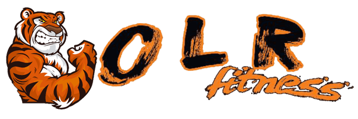
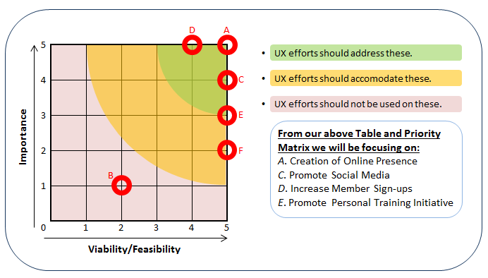

# Milestone Project 1
***

## _One Last Rep Responsive Website Project_
***

### What does it do and what does it need to fulfil?
This Milestone project creation is the culmination of learning and study from the first three modules of the Full Stack Developer
Course, HTML, CSS & User Centric Frontend Development, to build a mobile-first fully responsive website for a local startup Gym,
"One Last Rep."



This website creates a centered point for non-members and members alike to view the facilities and amenities at play,
the classes available, the wide facet of coaching, and enabling the contact of the Gym directly through a contact form.

### Functionality of Project.
The project utilises the Bootstrap Framework to create a multi-page fully responsive, Mobile-First approach Website. It is completely
within the scope of the guidelines of the milestone requirements and does not populate any back-end functions, nor
has any custom javascript been used. With that in mind please note that although this website contains two "forms", one fulfilling a
contact form requirement and one fulfilling a booking system for a Free class, they do not alert anyone that a submission has been
created and will not populate any server database.

Both forms hold data validation and all fields residing within are set to <i>required</i> ensuring information submitted is of 
the correct format. As is customary, both forms notify the user that their personal information such as, Name/Email/Phone etc will not be
shared with anyone, ensuring a sense of General Data Protection Regulations.

The font used throughout the site was imported into the HTML of each page from Google Fonts and is called <a href="https://fonts.google.com/?query=oswald">'Oswald'</a>, 
bringing a consistency to accompany the Corporate Branding and color scheme of the Company, throughout the website.

As described above, this project went outside the original brief and is based on the needs of a real-life local company and will be used to 
fulfill a considerable gap in their entry stake into the marketplace. Given this, the functionality of the website will evolve over time to incorporate 
a Merchandise store, interactive Video Tours, and Online bookings & payments


### Technologies Used.
* HTML ~ main Language used to structure the individual pages of the website.
* CSS ~ styling language used to format and visually build upon the accompanying HTML.
* <a href="https://getbootstrap.com/"> Bootstrap Framework</a> ~ Used as the core structuring layout building blocks of the website, ensuring mobile-frist design and responsive size display.
* <a href="https://www.jetbrains.com/pycharm/">PyCharm IDE</a> ~ PyCharm was used as the preferred IDE for this project.
* PyCharm built-in Terminal ~ Used to commit to local repository and further push to Github Repo ensuring version controlling of the project build.
* <a href="https://git-scm.com/">Git</a> ~ Installed on local device and integrated to PyCharm as a Plugin to enable version controlling.
* <a href="https://github.com/auxfuse/Milestone1">Github</a> ~ Used to host the deployed website and repository of all previous versions of the build.
* <a href="https://tinyjpg.com/">TinyJPG.com</a> ~ Used to compress images used throughout the website without affecting image quality/integrity.
* Google Chrome Developer Tools ~ Used as the core test phase throughout the project build life, testing the responsiveness of elements and CSS visuals.
* <a href="http://eye-dropper.kepi.cz/">Eye Dropper (Color Picker)</a> ~ Open Source Google Chrome Extension used to obtain hexadecimal/rgba/hsl values of colours. Built by Kepi (<a href="https://github.com/kepi">Kepi's Github</a>)
* Some <a href="https://getbootstrap.com/docs/4.3/getting-started/introduction/#js">Imported Javascript & JQuery</a> ~ For the Modal and Responsive Navbar expand & collapse functionality.
* Microsoft Excel ~ Used for the Creation of Wireframes.
* <a href="https://www.pexels.com/">Pexels</a> ~ Online Free stock imagery. Used for providing 2 out of the 3 testimonal images and the Hero image on the Home page.

### Deployment.
Website was created in PyCharm IDE. PyCharm is an Integrated Development Environment developed by JetBrains. I choose PyCharm
as my preferred IDE due to the enhanced programming capabilities therein and for further exposure to a non-browser related development environment.
Through PyCharm a local Git Repository was used, as was Github to ensure Version Controlling of the website was present from
the inception through to finalisation and deployment.

Cloning & Details:

In order to clone the website:
* Select the Repository from the Github Dashboard.
* Click on the <i>"Clone or download"</i> green button located above and to the right of the File Structure table.
* Click on the <i>"clipboard icon"</i> to the right of the Git URL to copy the web URL of the Clone. 
###### (See next image, highlighted in orange)


* Open your preferred Integrated Development Environment (IDE) and navigate to the terminal window.
* Change the directory to where you want to clone the repository too. (In the case of PyCharm the directory path can be found through the <i>"Navigate"</i> tab).
* Paste the Git URL copied from above and click <i>"Ok"</i>. (Again in the case of PyCharm once you click <i>"clone"</i>, Git Root mapping will be automatically set to the project Root directory). 


In order to deploy the website to Github pages, I:
* Selected the Repository from the Github Dashboard.
* Navigated to <i>"Settings"</i> and to the <i>"Github Pages"</i> Section.
* From the <i>"Source"</i> section, clicked on the dropdown and selected "Master Branch" from the associated List.
* Once <i>"Master Branch"</i> was selected, the page auto-refreshed, with a ribbon display detailing <i>"Github Pages source saved"</i> indicating the success of the deployment.
* The link to the website was found under the <i>"Github Pages"</i> section, with a ribbon notification stating:<br> __"Your site is published at <a href="https://auxfuse.github.io/Milestone1/">https://auxfuse.github.io/Milestone1/</a>"__

### User Experience Design
***
To read the full User Experience Design report please click <a href="https://github.com/auxfuse/Milestone1/blob/master/assets/UX/UXD.pdf">Here</a>.

>The information that follows is a synopsis of the attached full report:


##### <i>Scope</i>
The client wanted a professionally built, clean and customer driven website, promoting the Gym amenities and available assets to
attract new customers to the current clientele base, become a staple competitor in the current marketplace against rival Gyms, and
promote social media engagement potentially broadcasting to a wider audience than just the local communities. On the basis of this requirement
wireframes were created, simulating the differences in fully responsive mobile-first design, that the website could benefit from due to the ever rising
popularity & trend of smartphones and tablets. The website was to feature a host of focal points such as, individualised showcase sections for the
coaches, classes & amenities available to users at the Gym. A contact form for the user to submit surrounding any questions/queries they may have and a
secondary "Free" introductory class pop-up Modal form for booking.

##### <i>Strategy</i>
In following with this custom brief instead of the brief set out by the milestone of creating a website for a band, a meeting was coordinated between
myself and the owner of the gym to exchange vital information & assets to be hosted on the website. Several requirements were concluded through that meeting:

* the primary target audience for the business was people who wanted to lose weight, get fit/compete or change gyms from rival competitors; and how do we interact
with this audience?

* to create demand for general class retention and bespoke training sessions such as, Personal Training.

* creating a Culturally appropriate engaging website.

* why would a user/customer choose One Last Rep as their Gym?

* what creates a good Gym Experience?

* what does the user expect from the website?

__Each of the above requirements have the associated strategy attached to them in the UXD report.__

A priority Matrix was drafted from the culmination of scores decided upon from the following Opportunity/Problems Table:

Opportunity/Problems | Importance | Viability/Feasibility
--- | --- | ---
*A. Creation of Online Presence* | 5 | 5
*B. Merchandise Sales* | 1 | 2
*C. Promote Social Media* | 4 | 5
*D. Increase Member Sign-ups* | 5 | 4
*E. Promote Personal Training Initiative* | 3 | 5
*F. Gym history promoting competitive status* | 2 | 5



##### <i>Structure</i>
The overall structure of the website will be a conventional __"Family Tree"__. It will consist of 5 pages, a modal and several links to external
points of interest, i.e. Social Media. The Navbar on larger device widths will position itself at the top of the page, even when scrolling, and read
the title of each page from left to right. The title of the page currently active will highlight <i>"orange"</i> to notify the user of their location.
The navbar will collapse to a <i>"hamburger"</i> icon on smaller device, that when clicked will expand to show the underlying menu.

As is commonplace amongst industry standards, the official corporate branding Logo will be positioned to the left of the navbar and will also act as 
click to return to the <i>"Home"</i> page. Each page heading when hovered on will highlight to visualise to the user that this is a <i>"clickable"</i> action. Consistency
of the website was kept to a premium standard with constant call backs to the Logo colour scheme of Orange/Black/White/Navy and a recurring font.

A call-to-action (CTA) button producing a <i>"Modal form"</i> was utilised in the footer. In tandem with the <i>"contact"</i> form housed on the <i>"Contact"</i> page of the website,
each field of these forms are validated for specific inputs, i.e. Phone Number, requires numerical entry, and each field has been set to <i>"required"</i> before allowing
the user to submit.

A <i>"Carousel"</i> was used in the <i>"About"</i> page to showcase imagery of the Gym amenities. By using this feature we have instantly preserved vital space on
both smaller & larger screen widths instead of using a Gallery of images, striving for a less-is-more approach.

##### <i>Skeleton</i>
As described previously in the Scope section, wireframes were created to visualise the differences between large versus small screen widths and how the website
would respond to same. These wireframes were created through Microsoft Excel, and saved as .PNG. These were used as the concept design for the site, predetermining
the flow, colour scheme, fonts, sections and functionality. The side-by-side comparison of the Wireframes are produced in the full UXD report, with an example of each
device size coming up next:
* Larger Device View


* Smaller Device View


*Please click __<a href="https://github.com/auxfuse/Milestone1/tree/master/assets/ux/SkeletonPlane">Here</a>__ to view the complete list of Wireframes created.*

These wireframes templates do not 100% reflect the end result of the project and were only used as the original concept design to get started and for engagement with
the customer. To see the list of changes implemented on the website versus the original concept please see the full __<a href="https://github.com/auxfuse/Milestone1/blob/master/assets/UX/UXD.pdf">User Experience Design</a>__ report.

### Testing.
***
Throughout the build-life of the project, regular testing was conducted through the use of Chrome Developer tools, (being my primary browser). 
Starting from the mobile-first side of things each element on each page was tested to ensure it functions as expected. Using the device selector through the
dev tools, each device was selected to achieve the testing needed. If and when I encountered an error, I would first try to alleviate that error through the 
accompanying elements panel, and if successful replicate the fix in my IDE. If an error could not be fixed, my focus would turn to Slack and my fellow Code Institute
students for help with identifying the problem and advice for tackling same.

At the moment the website has been tested on Internet Explorer, Google Chrome, Microsoft Edge, Opera & Mozilla Firefox. The website works and functions as expected on Google Chrome, Microsoft Edge, Opera and
Mozilla Firefox, however it has major functional flaw in the "Carousel" implemented on the "About" page on Internet Explorer. This is a known issue amongst the community
of Bootstrap users and apparently has no webkit fix that I have been able to find and implement. 
The flaw stretches the center image and distorts it to the edge of the carousel container and ultimately creating awful User Experience for those on Internet Explorer. 
As a considerable amount of time was dedicated to trying to fix it, and with no clear fix in sight, I decided to leave it for now and detail it in the README as the 
only current error I have come across on the project. 


During my Mid-Project Review with my Mentor, it was suggested that my Media Queries be restructured as I had utilised ```Max-widths``` in my CSS, as this did not quite fit the brief
of mobile-first response. To combat this, I started by re-arranging my code to utilise the media queries from smallest to largest, removing any ```Max-widths``` specified in the stylesheet. Doing this greatly helped my understanding of the term
mobile-first and in doing so my code looks and functions in the correct flow and manner.
* Link to repo commit before restructure: <a href="https://github.com/auxfuse/Milestone1/tree/0a60fb53370c91c0688bd9a00bf0a867fc42f00c/css">CSS</a>
* Link to repo commit after restructure: <a href="https://github.com/auxfuse/Milestone1/blob/244c5666c8f8ff33c0b3f21b88ee23c2b2312046/css/style.css">CSS file after Restructure</a>

Other additional feedback from my mentor was to:
* remove the list-item icon that I originally had appearing after the Coaches Expertise list-items, accompanying the list-item icon used before each line, as this did not quite fit the overall aesthetic and generally provided a cluttered Design experience. <i>~ icon since removed, leaving only the custom list style bullet before each line</i>.

* lighten the call-to-action dark text to provide a more striking & eye-catching response as was the original intention for this CTA, to boost metrics for the Free introductory classes. <i>~ colour shade changed to ```#7f7f7f``` same as
unhovered/inactive state colours of the Navbar headings/social media icons etc</i>.

Regular use of the #peer-code-review channel in Slack was incredibly beneficial to me as a developer allowing others to test the website and critique same.
This would highlight problem areas, non-functioning elements and overall critique enabling me to work and strive towards a better end product. 

Also, use of the <a href="https://validator.w3.org/">W3C Validator</a> assisted in ensuring my code was up to professional grade standards and structured correctly. It highlighted several inconsistencies,
such as:
* ```padding: auto``` appearing in my CSS <i>~ since removed</i>.
* My modal having a mismatching ```ariadescribedby``` label <i>~ since rectified</i>.
* And a quirky error caused by the character set emoji "<3" to simulate a heart on one of the testimonials as detailed by the user. <i>~ no fix necessary as this is the language used by the user to describe a "heart" emoji</i>.


The final testing phase was for the customer to see the almost finished product. The website was demoed to them and was received positively by the Customer and their respective
colleagues and employees. 


### Work based on other code.

* The modal that is present on all pages through the Footer Call-to-action button, was based from the course "Whiskey Drop" Mini-project. This was heavily modified and styled to fit and suit the needs
of my Milestone project, with "Email" as the only field in the formset remaining similar.

* The border radius CSS code used on the testimonial images on the Home page weas researched and learned for use through <a href="https://9elements.github.io/fancy-border-radius/">Fancy Border Radius</a> created by Mirko & Nils.
...Mirko <a href="https://github.com/mirko314">Github</a> & Nils <a href="https://twitter.com/supremebeing09">Twitter</a>.

* <a href="https://autoprefixer.github.io/">Autoprefixer CSS Online</a> produced the webkit ```-o-object-fit: contain``` vendor prefix needed for the Carousel images to work on the Opera Browser.

* <a href="https://realfavicongenerator.net/">RealFaviconGenerator</a> was used to compress and produce the favicon.ico file and the code to implement the favicon was researched and found through
<a href="https://stackoverflow.com/questions/11893478/add-favicon-to-website">Stack Overflow</a>. 

### Special Thanks & Acknowledgments
***
* To my mentor, <a href="https://github.com/5pence">Spencer Barriball</a>, for incredible mentoring from suggesting the use of PyCharm as my IDE, to the strategy to use for the project, and for assisting during my project review with examples on how
 to structure Media Queries & what makes a good UX experience.

* To <a href="https://github.com/AJGreaves">Anna Greaves</a>, current channel lead for User Centric Frontend. Who has assisted in many back & forth conversations regarding questions and providing exceptional answers to all of us, provided critique through the #peer-review-channel & direct messaging, 
hosted incredibly structured User Centric Conference calls on a very frequent basis, and created a very easy to follow and understand application on the <a href="https://ajgreaves.github.io/bootstrap-grid-demo/">Bootstrap Grid</a>.

* To the Owner of One Last Rep, Dave O' Keeffe, for allowing me to undertake with his core business process, assets (including his corporate GDPR notice used on the Privacy Policy link) and overall time with meetings and queries surrounding same and use them as the basis and core brief for this project;
<a href="https://auxfuse.github.io/Milestone1/index.html">One Last Rep Website</a>

* To my fellow students in Code Institute and to the staff and mentors who converse & frequent Slack regularly with their own queries/ideas & opinions, and assisting with mine, to help me better understand all facets of this course!

* To the author of <a href="http://www.htmlandcssbook.com/">HTML & CSS</a> Jon Duckett for creating this incredible reference material suggested by some of my student colleagues in Slack.

##### Disclaimer:
This project was created for educational use. The Accreditation certificate was created by myself and is purely for design purposes only, and added to this project as a Mock-up example.

_The .idea folder in my Github Repo is a default folder created by my preferred IDE PyCharm and can be ignored._